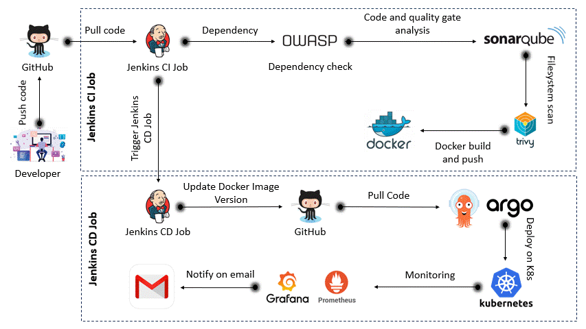

<p align="center">
  
  
  
  
  
</p>

<h1 align="center">End-to-End DevOps Project — Jenkins, EKS, ArgoCD, Prometheus, Grafana</h1>

<p align="center">
A fully automated CI/CD pipeline on AWS using Jenkins, SonarQube, ArgoCD, Prometheus & Grafana — with Terraform provisioning.
</p>


## 📜 Overview

This project demonstrates an end-to-end CI/CD pipeline deployed on AWS, with:

* Terraform-based infrastructure provisioning
* Jenkins for CI/CD
* SonarQube, OWASP Dependency Check, Trivy for code quality & security scanning
* Amazon EKS for Kubernetes cluster hosting
* ArgoCD for GitOps-based CD
* Prometheus & Grafana for monitoring.

---


## 🖥️ Architecture Diagram
---


---

## 🛠 Tech Stack

| Tool                                                                                                                       | Purpose                 |
| -------------------------------------------------------------------------------------------------------------------------- | ----------------------- |
|     | Infrastructure as Code  |
|                 | Cloud Hosting           |
|           | CI/CD Pipeline          |
|     | Code Quality            |
|              | Containerization        |
|  | Container Orchestration |
|                | GitOps CD               |
|  | Monitoring              |
|           | Dashboard Visualization |

---
## 📂 Project Structure

```plaintext
project/
├── terraform/          # Terraform code for infrastructure provisioning
├── Gitops              # Jenkins pipeline for the Deployment
├── K8s                 # Kubernetes YAML manifests for service
|── Frontend            # cContaines the Frontend files with Dokerfile
|── Backend             # cContaines the backend files with Dockerfile
```
---

## ⚙️ Infrastructure Setup

### 1️⃣ Provision EC2 Host via Terraform

```bash
cd terraform
terraform init
terraform plan
terraform apply -auto-approve
```
---

### 2️⃣ Install Required Tools on EC2

```bash
sudo apt-get update && sudo apt-get upgrade -y
sudo apt-get install docker.io docker-compose-v2 -y
sudo usermod -aG docker $USER && newgrp docker
sudo systemctl enable docker && sudo systemctl start docker

# Java & Jenkins
sudo apt install fontconfig openjdk-21-jre -y
curl -fsSL https://pkg.jenkins.io/debian-stable/jenkins.io.key | sudo tee \
  /usr/share/keyrings/jenkins-keyring.asc > /dev/null
echo deb [signed-by=/usr/share/keyrings/jenkins-keyring.asc] \
  https://pkg.jenkins.io/debian-stable binary/ | sudo tee \
  /etc/apt/sources.list.d/jenkins.list > /dev/null
sudo apt-get update && sudo apt-get install jenkins -y

# SonarQube, Trivy, AWS CLI, eksctl, kubectl
```

---

### 3️⃣ Configure AWS & EKS

```bash
aws configure
eksctl create cluster \
  --name my-cluster \
  --version 1.28 \
  --region us-east-1 \
  --nodegroup-name linux-nodes \
  --node-type t2.large \
  --nodes 2
```
---

### 🏗️ EC2 & EKS Cluster Instance Created:*


--

## 🔄 CI/CD Pipeline

### Jenkins CI Pipeline (Build, Scan, Push)

*CI Pipeline Screenshot:*


---

### 🔄Jenkins CD Pipeline (Deploy to EKS)

*CD Pipeline Screenshot:*


---

### 📧 Email Notification after Pipeline Success

*Email Screenshot:*


---

### 🔍 SonarQube Analysis report


---
## 📦 Kubernetes & ArgoCD Setup

```bash
kubectl create namespace argocd
kubectl apply -n argocd -f https://raw.githubusercontent.com/argoproj/argo-cd/stable/manifests/install.yaml
kubectl patch svc argocd-server -n argocd -p '{"spec": {"type": "NodePort"}}'
kubectl get svc -n argocd
```

---
## 🧭 Argo cd application Created

---
---
## 🧭 Argo cd application Deployment


---

## 📊 Monitoring — Prometheus & Grafana

### Install via Helm

```bash
helm repo add prometheus-community https://prometheus-community.github.io/helm-charts
helm repo update

# Prometheus
helm install prometheus prometheus-community/prometheus --namespace monitoring --create-namespace
kubectl patch svc prometheus-server -n monitoring -p '{"spec": {"type": "NodePort"}}'

# Grafana
helm install grafana grafana/grafana --namespace monitoring
kubectl patch svc grafana -n monitoring -p '{"spec": {"type": "NodePort"}}'
```
---
*Prometheus Monitering:*


---

## 🏆 Output Screenshots

| Description                  | Image                       |
| ---------------------------- | --------------------------- |
| Application Output frontend  |       |
| Application Output backend   |      |

---

##  ✅ Commands Reference

```bash
# Terraform
terraform init
terraform plan
terraform apply -auto-approve

# AWS CLI
aws configure

# EKS Cluster
eksctl create cluster ...

# ArgoCD NodePort Access
kubectl patch svc argocd-server -n argocd -p '{"spec": {"type": "NodePort"}}'

# Prometheus NodePort Access
kubectl patch svc prometheus-server -n monitoring -p '{"spec": {"type": "NodePort"}}'

# Grafana NodePort Access
kubectl patch svc grafana -n monitoring -p '{"spec": {"type": "NodePort"}}'
```
---
