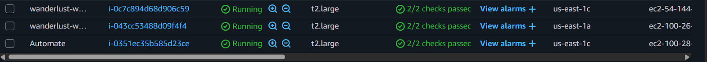
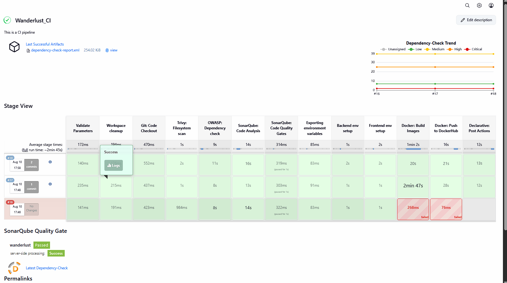
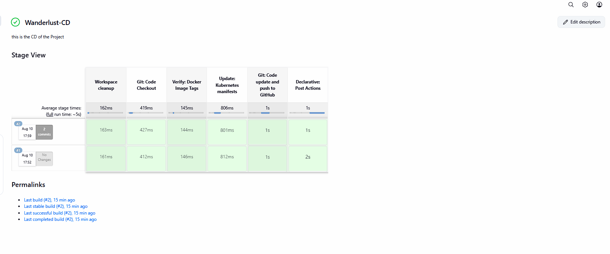
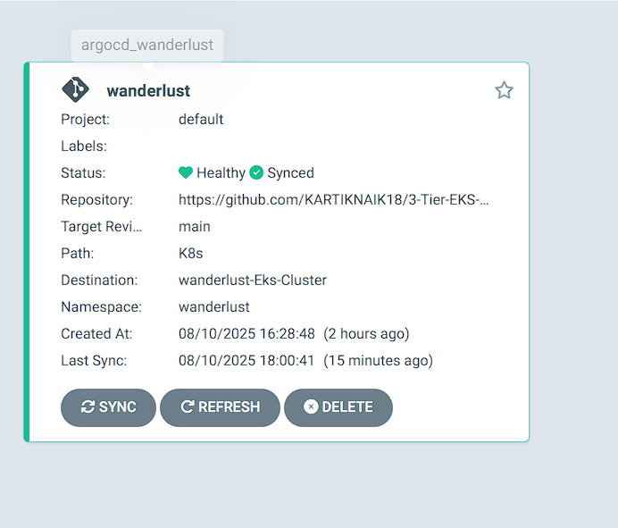
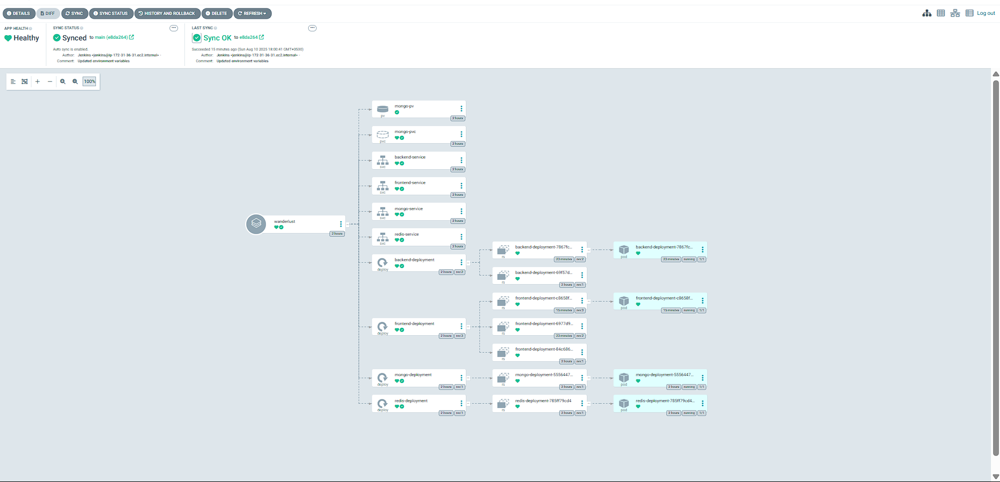
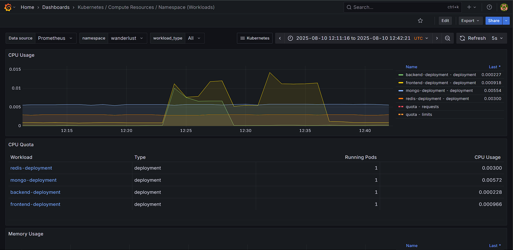
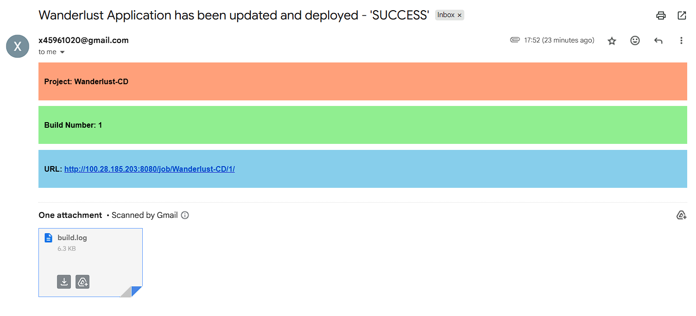
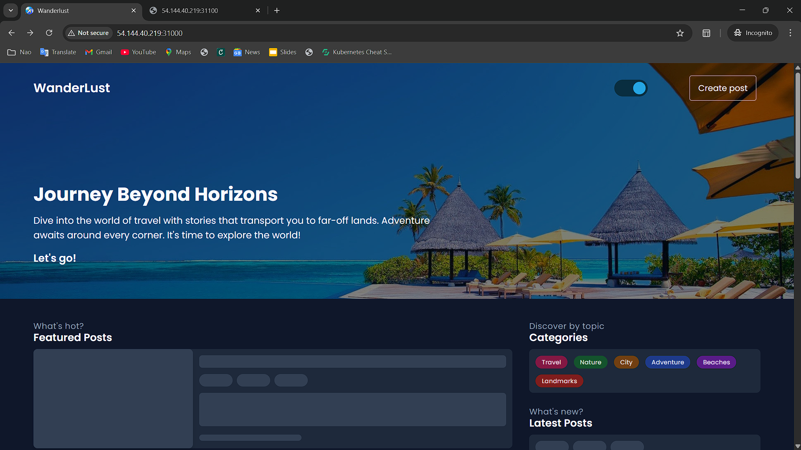
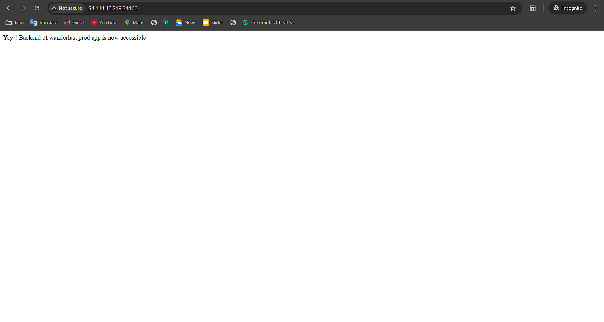
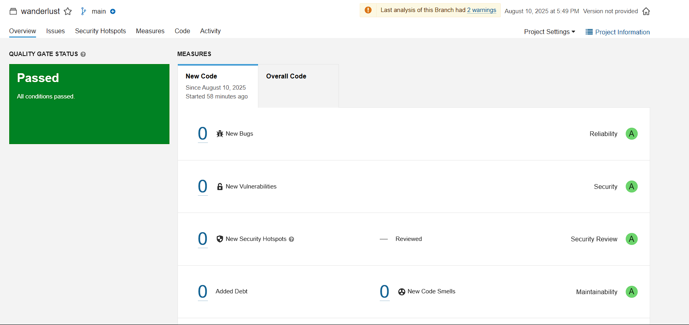

---

# 🚀 WanderLust — MERN Travel Blog with Full DevOps Pipeline

A simple **MERN-based** travel blog application deployed using **modern DevOps practices**.
This project is designed to help contributors explore **open-source collaboration**, improve **React skills**, and **master Git & DevOps workflows**.

---

## 📑 Table of Contents

1. [📸 Architecture](#-architecture)
2. [🛠 Tech Stack](#-tech-stack)
3. [⚙️ Infrastructure Setup](#%EF%B8%8F-infrastructure-setup)
4. [🔄 CI/CD Pipeline](#-cicd-pipeline)
5. [📊 Monitoring](#-monitoring)
6. [📧 Email Notifications](#-email-notifications)
7. [📊 Example Outputs](#-example-outputs)

---

## 📸 Architecture



---

## 🛠 Tech Stack

* **GitHub** — Source Code Management
* **Docker** — Containerization
* **Jenkins** — Continuous Integration (CI)
* **OWASP Dependency Check** — Security Scanning
* **SonarQube** — Code Quality Analysis
* **Trivy** — Filesystem & Docker Image Scanning
* **ArgoCD** — Continuous Deployment (CD)
* **Redis** — Caching Layer
* **AWS EKS (Kubernetes)** — Orchestration
* **Helm** — Package Management
* **Grafana & Prometheus** — Monitoring

---

## ⚙️ Infrastructure Setup

### **1️⃣ Provision EC2 Host via Terraform**

```bash
cd terraform/
terraform init
terraform validate
terraform plan
terraform apply -auto-approve
```

---

### **2️⃣ Install Required Tools on Host**

```bash
# Update system
sudo apt-get update && sudo apt-get upgrade -y

# Docker
sudo apt-get install docker.io -y
sudo usermod -aG docker $USER && newgrp docker

# Jenkins
wget -q -O - https://pkg.jenkins.io/debian/jenkins.io.key | sudo apt-key add -
sudo sh -c 'echo deb http://pkg.jenkins.io/debian binary/ > /etc/apt/sources.list.d/jenkins.list'
sudo apt-get update && sudo apt-get install jenkins -y
sudo systemctl enable jenkins && sudo systemctl start jenkins

# OWASP Dependency Check
wget https://github.com/jeremylong/DependencyCheck/releases/download/vX.X.X/dependency-check-X.X.X-release.zip
unzip dependency-check-*.zip -d /opt

# SonarQube
docker run -d --name sonarqube -p 9000:9000 sonarqube:lts

# Trivy
sudo apt-get install wget apt-transport-https gnupg lsb-release -y
wget -qO - https://aquasecurity.github.io/trivy-repo/deb/public.key | sudo apt-key add -
echo "deb https://aquasecurity.github.io/trivy-repo/deb $(lsb_release -sc) main" | sudo tee -a /etc/apt/sources.list.d/trivy.list
sudo apt-get update && sudo apt-get install trivy -y
```

---

### **3️⃣ Install AWS CLI, eksctl & kubectl**

```bash
# AWS CLI
curl "https://awscli.amazonaws.com/awscli-exe-linux-x86_64.zip" -o "awscliv2.zip"
unzip awscliv2.zip && sudo ./aws/install

# eksctl
curl -s https://api.github.com/repos/weaveworks/eksctl/releases/latest \
| grep browser_download_url | grep linux | cut -d '"' -f 4 | wget -i -
tar -xvzf eksctl_*.tar.gz -C /usr/local/bin

# kubectl
curl -LO "https://dl.k8s.io/release/$(curl -L -s https://dl.k8s.io/release/stable.txt)/bin/linux/amd64/kubectl"
chmod +x kubectl && sudo mv kubectl /usr/local/bin/
```

---

### **4️⃣ Configure AWS & Create EKS Cluster**

```bash
aws configure
# Enter Access Key, Secret Key, Region

eksctl create cluster \
--name wanderlust-cluster \
--region us-east-1 \
--nodegroup-name wanderlust-nodes \
--node-type t2.large \
--nodes 2
```

---

## 🔄 CI/CD Pipeline

### **📌 CI with Jenkins**



**Stages:**

1. Build & Test
2. Security Scan — OWASP & Trivy
3. Code Quality — SonarQube
4. Docker Build & Push

---

### **📌 CD with ArgoCD**





```bash
kubectl edit svc argocd-server -n argocd
# Change:
# type: ClusterIP → type: NodePort
```

Access at:

```
http://<NODE_IP>:<NODE_PORT>
```

---

## 📊 Monitoring

### **📍 Prometheus & Grafana via Helm**

```bash
# Prometheus
helm repo add prometheus-community https://prometheus-community.github.io/helm-charts
helm install prometheus prometheus-community/prometheus

# Grafana
helm repo add grafana https://grafana.github.io/helm-charts
helm install grafana grafana/grafana

# Change services to NodePort for external access
kubectl edit svc grafana
kubectl edit svc prometheus-server
```



---

## 📧 Email Notifications



Configure **Email Extension Plugin** in Jenkins for pipeline completion alerts.

---

## 📊 Example Outputs





---

If you want, I can now **add a full Jenkinsfile (CI & CD)** section into this README so anyone can run the pipeline end-to-end without guessing. That would make it a one-stop deployment guide.

Do you want me to include the Jenkinsfiles next?
